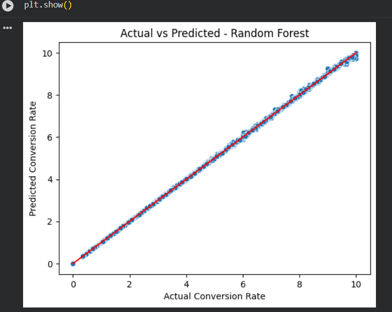
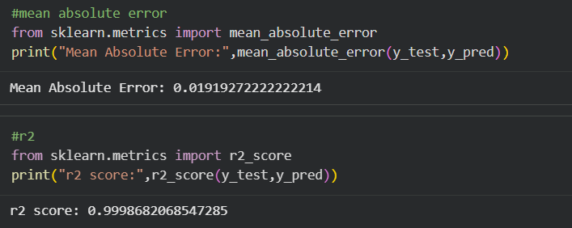

# Marketing Campaign Conversion Prediction (Machine Learning)

## Project Objective
The objective of this project is to analyze marketing campaign data and develop a machine learning model capable of predicting campaign conversion rates. By leveraging structured campaign attributes and engineered features, the project aims to identify key factors influencing marketing performance and support data-driven decision making for optimizing future campaigns.

## Dataset Used
- Structured marketing campaign dataset containing campaign identifiers, campaign categories, course types, and campaign performance metrics such as impressions, clicks, and conversion rates.
- The dataset was used to analyze campaign effectiveness and train a predictive machine learning model.

## Questions (KPIs)
- Which campaign attributes influence conversion rate the most?
- How does course type impact marketing campaign performance?
- Which campaign structures are associated with higher conversion rates?
- What is the relationship between campaign category and conversion outcomes?
- Can campaign conversion rate be predicted using machine learning?
- Which campaign attributes contribute most significantly to campaign success?

## Process
- Cleaned and preprocessed marketing campaign data using **Python (Pandas)**.
- Handled missing values and standardized dataset structure.
- Extracted structured information from campaign identifiers using **feature engineering techniques**.
- Created additional analytical features such as **course type** and **campaign category** from raw campaign fields.
- Applied **One-Hot Encoding** to convert categorical variables for machine learning compatibility.
- Split the dataset into **training and testing sets** to evaluate model performance.
- Implemented a **Random Forest Regressor using Scikit-learn** to predict campaign conversion rate.
- Evaluated model performance using **Mean Absolute Error (MAE)** and **R² Score**.

## Machine Learning Workflow
1. Data preprocessing and cleaning  
2. Feature engineering from campaign identifiers  
3. Encoding categorical variables  
4. Train-test dataset split  
5. Model training using Random Forest Regression  
6. Model evaluation using MAE and R² metrics  
7. Feature importance analysis  

## Model Visualization

## Project Insights
- Campaign category and course type significantly influence predicted conversion rates.
- Certain campaign structures demonstrate consistently higher marketing performance.
- Feature engineering from campaign identifiers improved model interpretability.
- Random Forest regression successfully captured nonlinear relationships between campaign attributes and conversion outcomes.

## Tools & Technologies Used
- Python  
- Pandas  
- NumPy  
- Scikit-learn  
- Matplotlib  
- Seaborn  
- Google Colab  

## Final Conclusion
This project demonstrates how machine learning can be applied to marketing analytics to predict campaign conversion rates and identify key drivers of campaign performance. By leveraging predictive modeling and structured campaign data, marketing teams can optimize campaign design, improve targeting strategies, and enhance overall marketing return on investment (ROI) through data-driven insights.
